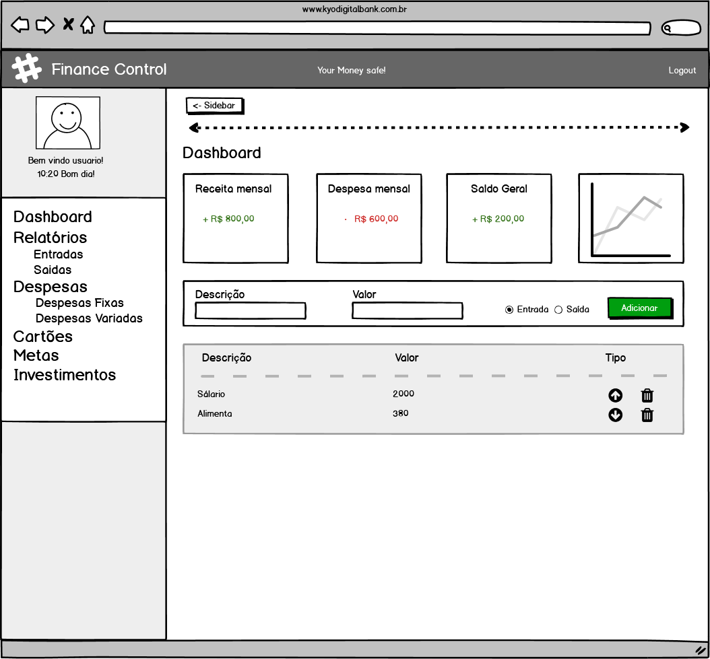
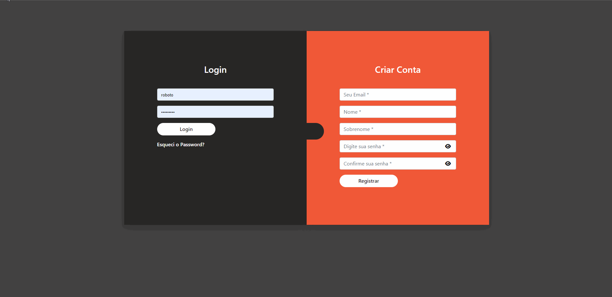
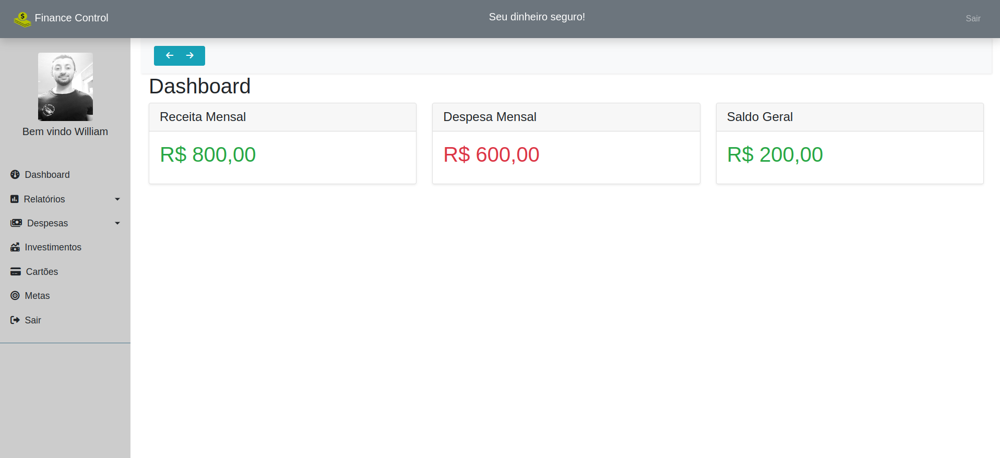

# 
Finance Control

:heavy_exclamation_mark: Projeto ainda em fase de desenvolvimento :exclamation:

Projeto feito com:
 - HTML, CSS, Bootstrap + PHP + MySQL 

O Intuito do projeto é criar uma aplicação web para controle financeiro pessoal e para amigos.
___

# Mockup do projeto
Agora será mostrado o Mockup inicial do projeto.

&nbsp;

# Imagens da Aplicação
Agora será mostrado como está o projeto no momento.

### Login e Registro

###### Validação de Registro

&nbsp;
### Dashboard

&nbsp;

### Instalação
- Clone este repositorio atráves do terminal, VS Code 

## Autor

> William Silva -> [Site e portfolio pessoal](https://bywilliams.github.io/portfolio/)

**Agradeço por terem acompanhdo a documentação e a explicação deste pequeno projeto, e trarei mais projetos.**
